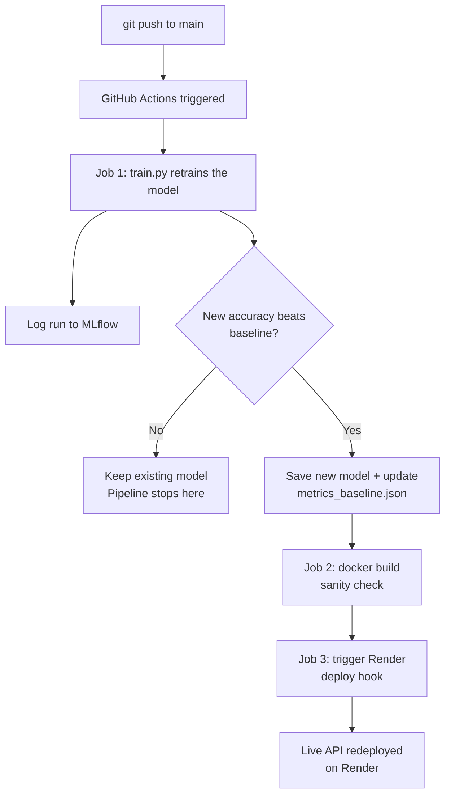

# Project 7 — End-to-End MLOps System (Capstone)

## TL;DR
An automated pipeline that retrains a credit risk model on every push to `main`, only promotes it to production if it beats the previous best, and automatically redeploys the live API when it does.

## Tech Stack
- **Model:** Gradient Boosting Classifier (scikit-learn)
- **Experiment tracking:** MLflow
- **API:** FastAPI + Uvicorn
- **Containerization:** Docker
- **CI/CD:** GitHub Actions
- **Deployment:** Render (auto-redeployed via deploy hook)

## Architecture



**Why it's split this way:** the Docker build (Job 2) runs on *every* push regardless of whether the model improved — a broken Dockerfile should always be caught immediately, not only on the pushes that happen to improve the model. The actual production deploy (Job 3) only fires when the new model is strictly better than the last one, so a regression never reaches the live endpoint.

## Live Endpoint
**API:** `https://credit-risk-api.onrender.com` *(update this after deploying)*
**Interactive docs:** `https://credit-risk-api.onrender.com/docs`

## Quickstart

**Run locally without Docker:**
```bash
cd capstone
pip install -r requirements-train.txt -r requirements-api.txt
python train.py                     # trains the model, produces model.joblib
uvicorn credit_risk_app:app --reload
```

**Run with Docker:**
```bash
cd capstone
docker build -t credit-risk-api .
docker run -p 8000:8000 credit-risk-api
```

**Test the live prediction endpoint:**
```bash
curl -X POST "http://localhost:8000/predict" \
     -H "Content-Type: application/json" \
     -d '{
           "person_age": 25,
           "person_income": 55000,
           "person_home_ownership": "RENT",
           "person_emp_length": 3.0,
           "loan_intent": "EDUCATION",
           "loan_grade": "B",
           "loan_amnt": 8000,
           "loan_int_rate": 11.5,
           "loan_percent_income": 0.15,
           "cb_person_default_on_file": "N",
           "cb_person_cred_hist_length": 3
         }'
```

## How the automated pipeline works
1. Any push to `main` triggers `.github/workflows/mlops-pipeline.yml`.
2. `train.py` retrains a Gradient Boosting model on the current dataset, using the best hyperparameters identified during Project 2's experiment tracking.
3. The new model's accuracy is compared against `metrics_baseline.json` (the previous best, committed to the repo).
4. If it's better: the new model + preprocessing pipeline are saved, the baseline file is updated, and the change is committed back to the repo automatically by the CI bot.
5. A Docker build sanity check always runs, confirming the container still builds correctly.
6. If (and only if) the model improved, a `curl` request hits Render's deploy hook, triggering a fresh build-and-deploy of the live API.

## Design notes / trade-offs
- **Why this model, not the ResNet50 from Projects 3-5?** The credit risk model trains in seconds on CPU, making it practical to retrain on every single push. The deep learning model takes much longer and would benefit from GPU runners — a reasonable design would trigger its retraining on a schedule (e.g. weekly) or manually, rather than on every commit. Both approaches are valid; the right choice depends on how often the underlying data actually changes enough to justify the retraining cost.
- **Why compare on accuracy alone?** For a production gate, a single, simple, hard-to-game metric is easier to reason about than a multi-metric weighted score. In a real team setting, this threshold would likely be discussed and could include F1 or AUC-ROC as a secondary check, especially given class imbalance considerations.
