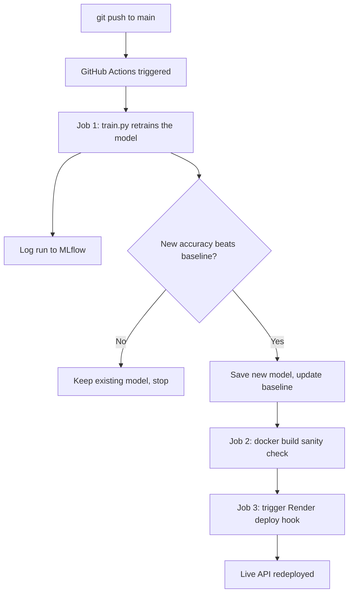

# Building a Self-Updating ML System: CI/CD, Deployment, and Everything That Broke Along the Way

*A technical deep dive into Project 7 of my MLOps portfolio — an automated pipeline that retrains, evaluates, and redeploys a model with zero manual intervention.*

---

## The Goal

Most ML tutorials stop at "train a model, save it." That's not how production systems actually work. In a real team, a model gets retrained regularly — new data comes in, someone tweaks a hyperparameter, and the question every single time is: **does this new version actually deserve to replace what's currently live?**

I wanted to build that decision-making into the pipeline itself, not leave it as a manual judgment call I'd have to remember to make every time. The result: a GitHub Actions workflow that retrains a credit risk model on every push, compares it against the current best, and — only if it's genuinely better — automatically redeploys the live API.

## Why the Credit Risk Model, Not the Deep Learning One

I made a deliberate scoping decision here that I think is worth explaining, because on the surface it might look like I "downgraded" from the more impressive ResNet50 project. I didn't — I matched the tool to the constraint.

The Gradient Boosting credit risk model trains in about a second on CPU. The ResNet50 pneumonia classifier takes several minutes *per epoch*, even with transfer learning, and GitHub's free-tier runners don't have GPUs. Retraining the deep learning model on every single push would mean either painfully slow CI runs or needing paid GPU runners — neither of which fits a portfolio project's constraints, and honestly, neither fits *most* real teams' constraints for a model that doesn't need to be retrained that often anyway.

The actual industry pattern this mirrors: lightweight models often get continuous retraining pipelines, while expensive models get scheduled or manually-triggered retraining (weekly, monthly, or on a real data-drift signal — which is exactly what Project 6 in this portfolio is designed to detect). Choosing the right retraining cadence for a given model's cost is itself an architectural decision, not a limitation I was working around.

## The Architecture

Two decisions here are deliberate, not accidental:

1. **The Docker build sanity check (Job 2) runs on every push, regardless of whether the model improved.** A broken Dockerfile is a bug that should be caught immediately, not only on the pushes that happen to also improve the model.
2. **The actual production deploy (Job 3) only fires when the model is strictly better.** This is the whole point — it's what prevents a bad or regressive change from ever reaching the live endpoint, without needing a human to remember to check.

## What Actually Broke (This Is the Real Case Study)

Here's the part most portfolio writeups skip, and I think it's the more valuable part to talk about in an interview: almost nothing worked on the first try, and debugging each failure taught me more about how these systems actually fit together than the "happy path" ever would have.

**1. WSL wasn't compatible with Docker Desktop.**
Docker Desktop on Windows depends on WSL2, and my WSL installation was outdated. `wsl --update` silently failed with error `0x80240438` — a Windows Update connectivity issue that had nothing to do with Docker itself. The fix required manually enabling the `Microsoft-Windows-Subsystem-Linux` and `VirtualMachinePlatform` Windows features via `dism.exe`, then separately forcing a web-based WSL kernel download (`wsl --update --web-download`) because the standard update path kept timing out. This alone took several restart cycles to resolve.

**2. The GitHub Actions workflow never triggered.**
I'd written the workflow to trigger `on: push: branches: [main]`, but my repository's default branch was `master`. A simple mismatch, but the kind that fails silently — no error, the workflow just never runs, and there's nothing in the UI screaming "wrong branch name." The fix was trivial once identified (`branches: [main, master]`), but it's a good reminder that CI/CD configuration needs to match the *actual* repository state, not the modern default you might assume.

**3. The CI bot couldn't push its own commits.**
Once training and evaluation started working, the pipeline still failed — this time because the automated commit step (where the CI bot pushes an updated model back to the repo) was rejected with a `403` permission error. GitHub's default `GITHUB_TOKEN` only has read access unless a workflow explicitly requests write permission. The fix was adding an explicit `permissions: contents: write` block to the workflow file — a security default that makes sense in general, but isn't obvious until you hit it.

**4. Render needed to know where to actually look.**
Because my Dockerfile lives inside a `capstone/` subfolder rather than the repo root, Render's default build process couldn't find it. Setting the **Root Directory** field to `capstone` in Render's service settings fixed this — a "monorepo" pattern that's common in real projects with multiple deployable services in one repository, but easy to overlook if you're used to single-service repos.

Every one of these was a real, non-obvious failure with a specific, learnable fix — not a conceptual gap in understanding MLOps, but the actual friction of getting real infrastructure to cooperate. I think that distinction matters: the theory of CI/CD is straightforward; making WSL, Docker, GitHub's permission model, and Render's build system all agree with each other in practice is where the real engineering work lives.

## The Result

The pipeline now runs end-to-end: a push to `main` triggers retraining, MLflow logs the run, the model is compared against `metrics_baseline.json`, and — if it wins — Render redeploys automatically. The live API is running right now at [jobkaton.onrender.com](https://jobkaton.onrender.com), and its most recent deploy was triggered by an automated CI commit, not a manual click.

## What I'd Do Differently at Larger Scale

- **A staging environment** before production — right now, an improved model goes straight to the live endpoint. In a team setting, I'd want a canary deploy or a manual approval gate between "model improved" and "model is live."
- **More than one metric gating promotion.** Right now the only gate is raw accuracy. In practice I'd include F1 or AUC-ROC as a secondary check, especially given how easily accuracy alone can be misleading under class imbalance (a lesson I ran into directly in Project 3).
- **Alerting**, not just automation — if a retraining run fails outright, right now I'd only know by checking the Actions tab. A real system should page someone.

## Closing Thought

The parts of this project that felt like "real engineering" weren't the parts that worked — they were the parts that broke and needed a specific, unglamorous fix. That's the actual day-to-day of MLOps work, and I'd rather be honest about that than present a version of this project where everything worked the first time.
